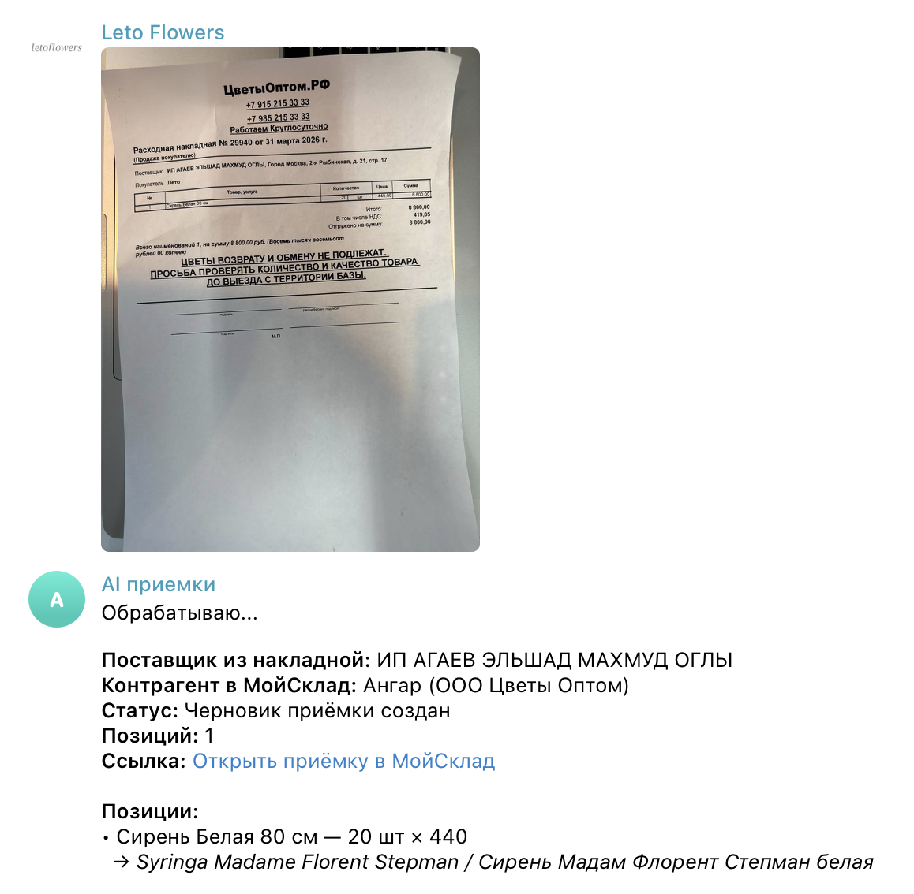

# AI-приёмка накладных в МойСклад

Телеграм-бот, который автоматически обрабатывает фото накладной, распознаёт поставщика и позиции с помощью GPT и создаёт черновик приёмки в МойСклад.

---

## Что делает проект

1. Пользователь отправляет фото накладной в Telegram  
2. GPT:
   - извлекает поставщика, дату и номер документа
   - парсит позиции (название, количество, цена)  
3. Система:
   - сопоставляет поставщика с МойСклад  
   - матчингует товары с каталогом  
4. Создаётся **черновик приёмки** 
5. Для заданного списка поставщиков создается исходящий платеж
5. Бот отправляет:
   - список позиций  
   - ссылку на приемку и платеж в МойСклад  

---

## Бизнес-задача

Ручной ввод накладных:
- долго  
- ошибки в названиях  
- человеческий фактор  

Решение:

- автоматизация приёмки через AI
- ускорение работы и снижение ошибок  

---

## Стек

- Python  
- OpenAI API  
- python-telegram-bot  
- MoySklad API
- RapidFuzz  
- Docker

---
## Запуск

### Локально

cd flower-invoice-parser

pip install -r requirements.txt

python bot.py

⸻

### Через Docker

docker build -t ai-invoice-bot .

docker run –env-file .env ai-invoice-bot

---
## Структура проекта

```text
flower-invoice-parser/
├── app/
│   ├── __init__.py
│   ├── bot.py                     # точка входа Telegram-бота
│   ├── config.py                  # загрузка конфигурации и переменных окружения
│   ├── prompts.py                 # промпты для OpenAI
│   │
│   ├── parsing/
│   │   ├── __init__.py
│   │   └── invoice_parser.py      # парсинг накладной через OpenAI
│   │
│   ├── matching/
│   │   ├── __init__.py
│   │   ├── product_catalog.py     # загрузка каталога товаров
│   │   ├── product_matcher.py     # сопоставление товаров
│   │   └── supplier_mapping.py    # сопоставление поставщиков
│   │
│   ├── integrations/
│   │   ├── __init__.py
│   │   └── moysklad_client.py     # интеграция с API МойСклад
│   │
│   └── common/
│       ├── __init__.py
│       └── utils.py               # вспомогательные функции
│
├── data/
│   └── products.csv               # каталог товаров для матчинга
│
├── deployment/
│   ├── Dockerfile                 # Docker-образ проекта
│   └── docker-compose.yml         # конфигурация запуска через Docker Compose
│
├── .dockerignore
├── .env.example
├── .gitignore
├── README.md
└── requirements.txt
```
---

## Пример выдачи


---

## Ограничения

- качество распознавания зависит от фото  
- возможны ошибки в названиях поставщиков  
- fuzzy matching не идеален  
- требуется ручная проверка

---

## Безопасность

- секреты хранятся в `.env`, не коммитится  
- API-ключи не попадают в репозиторий  

---
## Дальнейшее развитие 

- Улучшение качества распознавания
- Создание приемки из текста (без фото)

## Автор

Александра Сергеева